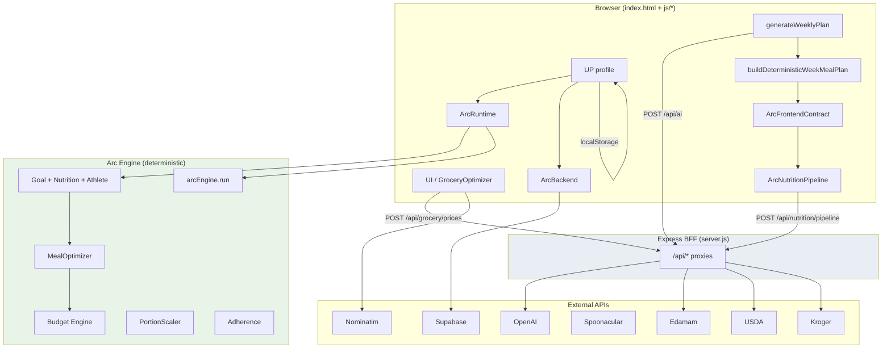
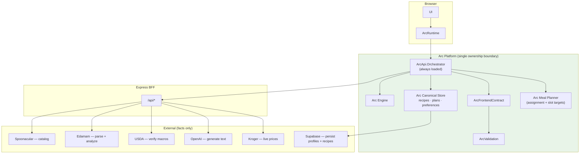

# Arc Architecture

> Documentation-only snapshot of the NutriAI / Arc codebase as of May 2026.  
> Describes current system boundaries, data ownership, external integrations, and recommended target architecture.

---

## Table of contents

1. [System overview](#1-system-overview)
2. [External APIs](#2-external-apis)
3. [Arc Engine components](#3-arc-engine-components)
4. [Supporting Arc modules (non-engine)](#4-supporting-arc-modules-non-engine)
5. [Data ownership by system](#5-data-ownership-by-system)
6. [API call sites](#6-api-call-sites)
7. [Source of truth recommendations](#7-source-of-truth-recommendations)
8. [Current architecture](#8-current-architecture)
9. [Recommended architecture](#9-recommended-architecture)
10. [Ownership overlaps and conflicts](#10-ownership-overlaps-and-conflicts)

---

## 1. System overview

Arc is a nutrition planning application with three primary layers:

| Layer | Location | Role |
|-------|----------|------|
| **Express BFF** | `server.js` | Holds API credentials; proxies all third-party nutrition/recipe/AI/grocery calls |
| **Arc Engine** | `js/arc-engine/` | Deterministic nutrition intelligence — targets, meal strategy, budget tiers, scaling, adherence |
| **Arc API** | `js/arc-api/` | External information providers (recipes, nutrients, prices, reasoning) |
| **Client glue** | `index.html`, `js/arc-runtime.js`, `js/arc-backend.js`, `js/arc-frontend-contract.js`, `js/arc-nutrition-pipeline.js` | UI, week generation, profile lifecycle, recipe contract normalization |

**Design principle (documented in code):**

```
External APIs → facts (recipes, nutrients, prices, language)
Arc Engine     → strategy (targets, meals, adherence, scaling)
Arc Validation → trust layer before user-facing output
```

The production browser app uses a **partial** Arc API load: validation and curation services are included, but the full orchestrator and provider services are only exercised in Node tests (`tests/arc-api.test.js`). Week generation in `index.html` calls OpenAI directly and uses `ArcNutritionPipeline` for macro verification.

---

## 2. External APIs

### 2.1 Summary table

| # | Service | Auth | Upstream base URL | BFF proxy route(s) | Direct browser call |
|---|---------|------|-------------------|--------------------|---------------------|
| 1 | **Edamam** | `EDAMAM_APP_ID` + `EDAMAM_API_KEY` | `https://api.edamam.com/api/nutrition-details` | `POST /api/nutrition`, `POST /api/edamam/parse`, `POST /api/nutrition/pipeline` | No |
| 2 | **Spoonacular** | `SPOONACULAR_API_KEY` | `https://api.spoonacular.com/recipes/*` | `POST /api/spoonacular/search`, `POST /api/spoonacular/bulk` | No |
| 3 | **USDA FoodData Central** | `USDA_API_KEY` | `https://api.nal.usda.gov/fdc/v1/*` | `GET /api/usda/search`, `GET /api/usda/food/:fdcId` | No |
| 4 | **OpenAI** | `OPENAI_API_KEY` | OpenAI SDK default (`/v1/chat/completions`) | `POST /api/ai` | No |
| 5 | **Kroger** | `KROGER_CLIENT_ID` + `KROGER_SECRET` (OAuth2 client credentials) | `https://api.kroger.com/v1/*` | `GET /api/kroger/location`, `POST /api/grocery/prices`, `POST /api/kroger/prices` | No |
| 6 | **Supabase** | `SUPABASE_URL` + `SUPABASE_ANON_KEY` | `{SUPABASE_URL}/auth/v1/*`, `{SUPABASE_URL}/rest/v1/arc_profiles` | `GET /api/config/public` (bootstrap only) | Yes — auth + REST after bootstrap |
| 7 | **OpenStreetMap Nominatim** | None (usage policy applies) | `https://nominatim.openstreetmap.org/reverse` | — | Yes — reverse geocoding |
| 8 | **jsDelivr CDN** | None | `https://cdn.jsdelivr.net/npm/@supabase/supabase-js@2.49.1/...` | — | Yes — script load |

Environment variables are defined in `.env.example`. Client-side provider flags are surfaced via `js/config/apiConfig.js`.

---

### 2.2 Edamam — Nutrition Analysis API

**Purpose:** Primary nutrition analysis — ingredient parsing, recipe macro computation, diet/health labels.

**Provides:**
- Parsed ingredient lines (`foods[]`, normalized text)
- Recipe macros: calories, protein, fat, carbs (`totalNutrients`)
- `dietLabels`, `healthLabels`

**Does not own:** Calorie targets, goal strategy, portion scaling decisions.

**Upstream endpoints:**
- `POST /api/nutrition-details?app_id=…&app_key=…` — body: `{ title, ingr: string[] }`

**Server implementation:** `callEdamamNutritionDetails()` in `server.js` (~313–386); endpoint constant in `js/arc-api/edamamHelpers.js`.

---

### 2.3 Spoonacular — Recipe API

**Purpose:** Recipe catalog, search, bulk retrieval. Used for discovery and as a low-confidence nutrition fallback.

**Provides:**
- Search results: `id`, `title`, `image`, `servings`, `readyInMinutes`, tags
- Bulk detail: `extendedIngredients`, `instructions`, optional `nutrition`

**Does not own:** Macro truth, calorie targets, meal slot optimization.

**Upstream endpoints:**
- `GET /recipes/complexSearch`
- `GET /recipes/informationBulk`

**Fallback role:** When Edamam fails, `nutritionFallbackAfterEdamam()` in `server.js` may call Spoonacular bulk nutrition (~406–427).

---

### 2.4 USDA FoodData Central

**Purpose:** Nutrition verification and reconciliation — the code's declared macro **source of truth**.

**Provides:**
- Food search: `fdcId`, `description`, normalized macros
- Food detail: full nutrient list, serving weight
- Verification deltas vs Edamam-reported macros

**Does not own:** Recipe discovery, grocery pricing.

**Upstream endpoints:**
- `GET /fdc/v1/foods/search`
- `GET /fdc/v1/food/{fdcId}`

**Server comment:** `/* ── USDA FoodData Central (nutrition source of truth) ── */` at `server.js:767`.

---

### 2.5 OpenAI — Chat Completions

**Purpose:** AI reasoning only — meal/week generation, optimization suggestions, instruction enhancement, tagging. **Never authoritative for displayed macros.**

**Provides:**
- Natural-language JSON (recipe libraries, meal ideas, optimization bullets)
- Instruction enhancement text

**Does not own:** TDEE, deterministic meal presets, budget tiers, final macro totals.

**Model:** `gpt-4o-mini` (`server.js:929`)

**Task types** (via `taskType`): `optimization`, `week_generation`, `week_recipe_library`, `week_meal_assignment`, `instruction_enhancement`, `tagging`, `classification`, etc.

**Caching:** In-memory, 20-minute TTL; request deduplication for concurrent identical calls.

---

### 2.6 Kroger — Products & Locations API

**Purpose:** Live US grocery pricing, store location by ZIP, product search/substitutions.

**Provides:**
- OAuth token (client credentials)
- Nearest store: `locationId`, `name`, `chain`, `address`
- Product prices: `priceRegular`, `pricePromo`, `priceEffective`, `brand`, `image`

**Does not own:** Nutrition analysis, budget tier definitions.

**Upstream endpoints:**
- `POST /v1/connect/oauth2/token`
- `GET /v1/locations?filter.zipCode.near=…`
- `GET /v1/products?filter.term=…&filter.locationId=…`

**Fallback:** `ArcEngine.Budget` tier heuristics via `krogerService.arcGroceryFallback()`.

---

### 2.7 Supabase — Auth + Postgres

**Purpose:** User identity (Auth) and cloud profile persistence.

**Provides:**
- Email/password and Google OAuth sessions
- `arc_profiles` table: `{ profile jsonb, app_state jsonb, onboarding_completed_at, updated_at }`

**Does not own:** Nutrition intelligence, recipe content generation.

**Schema:** `supabase/migrations/20260515000000_arc_profiles.sql`

**Bootstrap:** Server exposes public keys at `GET /api/config/public`; client initializes in `js/arc-runtime.js` and `js/arc-backend.js`.

---

### 2.8 OpenStreetMap Nominatim

**Purpose:** Reverse geocode browser GPS coordinates to city/country/postcode for regional pricing and Kroger ZIP resolution.

**Provides:** `{ address: { city, town, village, county, country, postcode, … } }`

**Caller:** `index.html` `doGeo()` (~8919–8949), triggered by `navigator.geolocation`.

**Note:** No API key; subject to Nominatim rate limits and attribution requirements.

---

## 3. Arc Engine components

All modules live in `js/arc-engine/`. Load order matters; `arcEngine.js` is the orchestrator.

| Component | File | Namespace | Purpose |
|-----------|------|-----------|---------|
| **Nutrition Engine** | `arcNutritionEngine.js` | `ArcEngine.Nutrition` | Mifflin–St Jeor BMR/TDEE, activity factors, protein/fat/carb math, `buildMacroTargets()` |
| **Goal Engine** | `arcGoalEngine.js` | `ArcEngine.Goal` | Maps onboarding goals to slugs/strategies; pace → daily kcal delta; `computeGoalTargets()` |
| **Athlete Engine** | `arcAthleteEngine.js` | `ArcEngine.Athlete` | Phase/day-type calorie & macro multipliers (`offseason`, `performance_day`, etc.) |
| **Meal Optimizer** | `arcMealOptimizer.js` | `ArcEngine.MealOptimizer` | Deterministic meal **strategy presets** and **weighted per-slot macro splits** (`optimizeMeals`, `buildMealSlots`) |
| **Budget Engine** | `arcBudgetEngine.js` | `ArcEngine.Budget` | Grocery **constraint tiers** (low/moderate/premium): max cost/serving, protein prefs, batch bias |
| **Portion Scaler** | `arcPortionScaler.js` | `ArcEngine.PortionScaler` | Scales recipe nutrition/ingredients to slot targets |
| **Adherence Engine** | `arcAdherenceEngine.js` | `ArcEngine.Adherence` | Meal event log scoring, patterns, `futureAdaptationSignals()` |
| **Engine orchestrator** | `arcEngine.js` | `ArcEngine` | `run()`, `computeTargets()`, `generateNutritionTargets()`; wires all modules |

**Pipeline inside `ArcEngine.run()`:**

```
Goal Engine → Nutrition context → Athlete Engine → Meal Optimizer
  → Budget Engine → Portion Scaler (when recipe present) → Adherence
```

**Tests:** `tests/arc-engine.test.js` (`npm run test:arc-engine`)

**Boundary:** Arc Engine has **no direct HTTP calls**. External data arrives via `js/arc-api/` when the orchestrator is loaded.

---

## 4. Supporting Arc modules (non-engine)

### 4.1 Arc API layer (`js/arc-api/`)

| Component | File | Role |
|-----------|------|------|
| **API orchestrator** | `apiOrchestrator.js` | `ArcApi.Orchestrator` — responsibility routing, `runAdaptiveMealPipeline` |
| **Validation** | `arcValidationService.js` | Macro sanity, impossible nutrition, scaling checks |
| **Recipe curation** | `arcRecipeCurationService.js` | Score/rank/variety-balance candidates |
| **Spoonacular service** | `spoonacularService.js` + `providers/spoonacularProvider.js` | Recipe search/discovery |
| **Edamam service** | `edamamService.js`, `edamamHelpers.js`, `providers/edamamProvider.js` | Ingredient parse, recipe nutrition |
| **USDA service** | `usdaService.js` + `providers/usdaProvider.js` | Macro verification |
| **OpenAI service** | `openaiService.js` + `providers/openaiProvider.js` | Adaptation/reasoning |
| **Kroger service** | `krogerService.js` + `providers/krogerProvider.js` | Live pricing; budget-engine fallback |
| **Infrastructure** | `arcCache.js`, `arcRateLimit.js`, `arcTrace.js`, `providers/providerBase.js` | Cache, rate limits, tracing, HTTP helpers |

**Orchestrator responsibility map** (`apiOrchestrator.js:36–87`):

| Responsibility | Owner |
|----------------|-------|
| `recipe_retrieval`, `recipe_metadata`, `meal_discovery` | Spoonacular |
| `ingredient_parsing`, `food_understanding`, `recipe_nutrition_analysis`, `diet_labels` | Edamam |
| `nutrition_verification`, `macro_validation`, `source_of_truth` | USDA |
| `adaptation`, `optimization`, `reasoning` | OpenAI |
| `grocery_pricing`, `availability`, `substitutions` | Kroger |

**Adaptive pipeline** (tested, not loaded in production HTML):

```
ArcEngine.run → Spoonacular → Edamam → USDA → Validation → OpenAI → Kroger → PortionScaler
```

### 4.2 Client integration modules

| Module | File | Role |
|--------|------|------|
| **Arc Runtime** | `js/arc-runtime.js` | `profileToEngineInput(UP)`; delegates TDEE/macros to `ArcEngine`; Supabase bootstrap |
| **Arc Backend** | `js/arc-backend.js` | Supabase auth + `arc_profiles` upsert/fetch |
| **Frontend contract** | `js/arc-frontend-contract.js` | Canonical recipe shape: `cal`, `p`, `c`, `f`, `cat`, `ing`, `steps` |
| **Nutrition pipeline** | `js/arc-nutrition-pipeline.js` | `ArcNutritionPipeline.verifyRecipes()` → `POST /api/nutrition/pipeline` |
| **Monolith UI** | `index.html` | `UP` profile, `generateWeeklyPlan`, `buildDeterministicWeekMealPlan`, `GroceryOptimizer`, Kroger UI |

### 4.3 Production script load vs test load

**Loaded in `index.html` (~2591–2613):**
- Arc config, trace, validation, curation, all engine modules, runtime, nutrition pipeline, backend, frontend contract

**Not loaded in production HTML:**
- `apiOrchestrator.js`, `spoonacularService.js`, `edamamService.js`, `usdaService.js`, `krogerService.js`, `openaiService.js`, provider adapters

Production week flow bypasses the full orchestrator and calls `/api/ai` and `/api/nutrition/pipeline` directly from inline `index.html` functions.

---

## 5. Data ownership by system

| Data domain | Owner (writes authoritative values) | Consumers / transformers |
|-------------|-------------------------------------|--------------------------|
| **Daily calorie & macro targets** | Arc Engine (`Goal` + `Nutrition`) via `ArcRuntime.generateNutritionTargets` | `UP.tdee`, `UP.macros`, `UP.customCal`; `getCalTarget()` / `getMacroTargets()` in `index.html` |
| **Per-meal macro targets (engine path)** | Arc Engine `MealOptimizer` — weighted slot splits (e.g. 28/32/40% for 3 meals) | `runAdaptiveMealPipeline` → `PortionScaler` |
| **Per-meal macro targets (UI week path)** | `index.html` `computeMealNutritionTargets()` — **equal split** across slots | `ArcNutritionPipeline` fallbacks, week verification |
| **User preferences** | `UP` profile object (in-memory) | `ArcRuntime.profileToEngineInput`, AI prompts, `ArcEngine.run` |
| **Profile persistence** | `localStorage` (`userProfile`) + Supabase `arc_profiles` | `ArcBackend.mergeProfileState` — newest `updatedAt` wins |
| **Recipe titles & structure** | OpenAI (week gen) or Spoonacular (adaptive pipeline) | `ArcFrontendContract`, render functions |
| **Recipe ingredients (text)** | OpenAI (week gen) or Spoonacular (`extendedIngredients`) | Edamam parse, nutrition pipeline, `GroceryOptimizer` |
| **Recipe instructions** | OpenAI (week gen) + optional OpenAI enhancement | `ArcFrontendContract` normalizes to `{ phase, instruction }[]` |
| **Recipe macros (verified/display)** | Edamam analysis reconciled with USDA (`/api/nutrition/pipeline`) | Overwrites `cal/p/c/f` on recipes before display |
| **Week meal assignment** | `index.html` `buildDeterministicWeekMealPlan` + `mealPlan` state | `normalizeWeekPayloadContract` for repair/fallback |
| **Meal strategy presets** | Arc Engine `MealOptimizer` | Referenced in prompts; **not wired into week assignment today** |
| **Grocery budget constraints** | Arc Engine `Budget` tiers | Kroger service fallback, orchestrator |
| **Grocery list & baseline prices** | `GroceryOptimizer` + `REGIONS` multipliers in `index.html` | Shopping UI |
| **Live store prices** | Kroger API (when configured + US ZIP) | `enrichShoppingWithKroger()` patches `priceUsd` |
| **Adherence events** | `UP` / app state | `ArcEngine.Adherence` when `adherenceLog` passed to `run()` |
| **User identity** | Supabase Auth | Session gates cloud sync |

### Canonical data shapes

**User profile (`UP`):** `name`, `email`, `height`, `weight`, `age`, `sex`, `activity`, `goal`, `weightGoalPaceLbWeek`, `meals`, `skill`, `restrictions`, `dislikes`, `budget`, `weeklyBudget`, `region`, `krogerZip`, `krogerLocationId`, `groceryNearCity`, `tdee`, `customCal`, `useCustom`, `macros`, `weeklyPlan`, `weeklyPlanDraft`, `servingOverrides`, `arcSavedRecipes`, `mealFeedback`, `arcAdaptive`, `arcBehavior`, `household`, etc.

**Frontend recipe contract:** `cal`, `p`, `c`, `f`, `cat`, `ing[]`, `steps[]`, plus passthrough `name`, `servings`, `nutritionConfidence`, `image`, `tags`.

**Week payload:** `{ recipes: [...], plan: { Mon: { Breakfast: recipeId, ... }, ... } }`

---

## 6. API call sites

### 6.1 Server-side upstream calls (`server.js`)

| BFF route | Upstream | Server function / lines |
|-----------|----------|-------------------------|
| `POST /api/nutrition` | Edamam nutrition-details | `callEdamamNutritionDetails` (~534–608) |
| `POST /api/edamam/parse` | Edamam nutrition-details (parse mode) | (~611–649) |
| `POST /api/spoonacular/search` | Spoonacular complexSearch | (~658–698) |
| `POST /api/spoonacular/bulk` | Spoonacular informationBulk | (~701–764) |
| `GET /api/usda/search` | USDA foods/search | (~793–825) |
| `GET /api/usda/food/:fdcId` | USDA food/{id} | (~828–848) |
| `POST /api/ai` | OpenAI chat.completions | (~893–1041) |
| `POST /api/nutrition/pipeline` | Edamam → USDA validation | (~1044–1265) |
| `GET /api/kroger/location` | Kroger /locations | (~1518–1529) |
| `POST /api/grocery/prices` | Kroger /products | `handleLiveGroceryPrices` (~1533–1588) |
| `POST /api/kroger/prices` | Same as above | (~1590–1591) |
| Internal fallback | Spoonacular bulk / USDA search | `nutritionFallbackAfterEdamam` (~406–503), `fetchSpoonacularNutrition` (~406–427) |

### 6.2 Browser → BFF (production paths)

| Client caller | BFF route | Purpose |
|---------------|-----------|---------|
| `index.html` `callAI()` (~8646) | `POST /api/ai` | Week recipe library, optimization, instruction enhancement, tagging |
| `index.html` `generateWeeklyPlan` → `callAIWithRetry` (~10550) | `POST /api/ai` | `taskType: week_recipe_library` |
| `js/arc-nutrition-pipeline.js` `verifyRecipe()` (~110) | `POST /api/nutrition/pipeline` | Verify/overwrite recipe macros |
| `index.html` `applyWeek` (~10526–10528) | via `ArcNutritionPipeline.verifyRecipes` | Batch verify week recipes |
| `index.html` `enrichShoppingWithKroger` (~13234) | `POST /api/grocery/prices` | Live price overlay on shopping list |
| `js/arc-runtime.js` bootstrap (~258) | `GET /api/config/public` | Supabase URL + anon key |

### 6.3 Browser → external (direct, no BFF)

| Client caller | External URL | Purpose |
|---------------|--------------|---------|
| `index.html` `doGeo()` (~8921) | `nominatim.openstreetmap.org/reverse` | GPS → region/ZIP |
| `js/arc-backend.js` | `{SUPABASE_URL}/auth/v1/*` | Sign-in, sign-up, OAuth, reset |
| `js/arc-backend.js` | `{SUPABASE_URL}/rest/v1/arc_profiles` | Profile upsert/select |
| `index.html` script tag (~2591) | jsDelivr Supabase UMD | Load Supabase SDK |

### 6.4 Arc API services → BFF (test / future adaptive path)

| Service file | BFF route |
|--------------|-----------|
| `spoonacularService.js:74` | `POST /api/spoonacular/search` |
| `spoonacularService.js:149` | `POST /api/spoonacular/bulk` |
| `edamamService.js:65` | `POST /api/edamam/parse` |
| `edamamService.js:175` | `POST /api/nutrition` |
| `usdaService.js:86` | `GET /api/usda/search` |
| `usdaService.js:111` | `GET /api/usda/food/:fdcId` |
| `openaiService.js:263,380` | `POST /api/ai` |
| `krogerService.js:66` | `POST /api/kroger/prices` |
| `krogerService.js:123` | `GET /api/kroger/location` |
| `apiOrchestrator.js` | Dispatches all of the above via providers in `runAdaptiveMealPipeline` |

### 6.5 Production week generation flow (call sequence)

```
1. index.html  callAIWithRetry(..., taskType: 'week_recipe_library')
      → POST /api/ai  (OpenAI generates recipe library JSON)

2. index.html  buildDeterministicWeekMealPlan(library, slots)
      → local only (category rotation, no API)

3. index.html  normalizeWeekPayloadContract(...)
      → ArcFrontendContract (local)

4. ArcNutritionPipeline.verifyRecipes(recipes, mealTargets)
      → POST /api/nutrition/pipeline  (Edamam + USDA per recipe)

5. index.html  persist mealPlan, UP.weeklyPlan
      → localStorage + optional Supabase upsert
```

---

## 7. Source of truth recommendations

These recommendations align with the responsibility map in `apiOrchestrator.js` and comments throughout the codebase, while accounting for **what production actually does today**.

| Domain | Recommended source of truth | Rationale | Current reality |
|--------|------------------------------|-----------|-----------------|
| **Recipes** | **Arc canonical store** (future: Supabase `arc_recipes` or internal cache), **seeded by Spoonacular** for catalog discovery and **OpenAI** for generative week libraries | Recipes are composed artifacts; no external API should be the long-term owner. Spoonacular provides structured catalog data; OpenAI provides creative generation. Both should be ingested and normalized through `ArcFrontendContract`. | OpenAI owns week recipe content; Spoonacular only used in test orchestrator path |
| **Ingredients** | **Edamam** (parsed/normalized lines) with **Spoonacular `extendedIngredients`** as structural input | Edamam understands quantities and food entities; Spoonacular provides raw recipe structure | OpenAI generates ingredient strings in week flow; Edamam parses at verification time |
| **Instructions** | **Arc canonical store**, authored by **OpenAI** (with optional enhancement pass), validated by **ArcFrontendContract** | Instructions are presentation/trust content, not nutrition facts. OpenAI is appropriate for generation; Arc normalizes shape. | OpenAI generates; contract normalizes; enhancement via `/api/ai` optional |
| **Macros** | **USDA** (verification/truth) with **Edamam** (primary analysis) | Pipeline pattern already implemented: Edamam computes, USDA validates/reconciles, `ArcValidation` gates display | Matches `/api/nutrition/pipeline` behavior; AI macro estimates always overwritten |
| **Grocery pricing** | **Kroger** (live, when available) with **Arc Budget Engine** (tier constraints + fallback estimates) and **REGIONS** (offline baseline) | Kroger is the only live price feed; Arc tiers define budget constraints; regional multipliers cover non-Kroger geographies | Three layers coexist — see conflicts section |
| **Meal assignment** | **Arc Engine `MealOptimizer` + deterministic planner** (engine-owned strategy applied to verified recipe pool) | Meal assignment is strategy, not external fact. Engine already owns slot weighting; assignment logic should live alongside it, not in OpenAI. | `buildDeterministicWeekMealPlan` in `index.html` uses simple category rotation; ignores `MealOptimizer` slot weights |
| **User preferences** | **Supabase `arc_profiles.profile`** (cloud) with **localStorage** as offline cache | Profile is user-owned state; cloud is authoritative for signed-in users; merge by `updatedAt` | Already implemented via `ArcBackend.mergeProfileState` |

### Macro confidence ladder (recommended, matches server pipeline)

| Confidence | Condition |
|------------|-----------|
| **High** | Edamam analysis + USDA validation within tolerance (`edamam+usda`) |
| **Medium** | USDA-only fallback, or Edamam with partial USDA match |
| **Low** | Spoonacular nutrition fallback, or AI estimates retained (should not display without verification) |

---

## 8. Current architecture



### Key characteristics of current architecture

1. **BFF pattern** — All paid API keys stay server-side; browser calls same-origin `/api/*`.
2. **Split week path** — Production uses OpenAI + deterministic assignment + nutrition pipeline; the full `ArcApi.Orchestrator` adaptive pipeline exists but is test-only.
3. **Engine partially integrated** — TDEE/macros delegate to Arc Engine via `ArcRuntime`, but meal slot targets and week assignment use separate UI logic.
4. **Dual nutrition paths** — `ArcNutritionPipeline` (production) and orchestrator pipeline (tests) share the same server endpoint but different client entry points.
5. **Triple grocery pricing** — Regional multipliers, Kroger live prices, and budget-tier heuristics can all influence displayed costs.

---

## 9. Recommended architecture



### Recommended changes (documentation intent — no code changes)

| Area | Recommendation |
|------|----------------|
| **Unify week generation** | Route `generateWeeklyPlan` through `ArcApi.Orchestrator` instead of inline `callAI` + local assignment |
| **Single meal target source** | Replace `computeMealNutritionTargets` equal-split with `ArcEngine.MealOptimizer.buildMealSlots` output |
| **Canonical recipe store** | Persist verified recipes to Supabase (or local indexed cache) so OpenAI/Spoonacular are ingestion sources, not owners |
| **Consolidate grocery pricing** | Define explicit precedence: Kroger live → regional estimate → budget-tier fallback; never show all three as competing values |
| **Load full Arc API in production** | Include orchestrator + services in `index.html` script list to eliminate test/production divergence |
| **Meal assignment in engine** | Move `buildDeterministicWeekMealPlan` logic into `ArcEngine.MealOptimizer` or a new `arcWeekPlanner.js` module |
| **Nominatim proxy** | Optionally proxy geocoding through BFF to centralize rate-limit handling and cache results |

### Target data flow (week generation)

```
User preferences (Supabase/localStorage)
  → ArcEngine.run (targets + meal slots + budget)
  → OpenAI (recipe library proposal — structure only)
  → Spoonacular enrichment (optional, for catalog recipes)
  → Edamam parse + analyze
  → USDA verify (source of truth for macros)
  → ArcValidation gate
  → Arc Meal Planner (deterministic assignment using engine slot targets)
  → Arc Canonical Store (persist verified week)
  → UI render via ArcFrontendContract
  → Kroger price overlay (shopping phase only)
```

---

## 10. Ownership overlaps and conflicts

### 10.1 Meal-level macro targets (engine vs UI)

| Aspect | Arc Engine `MealOptimizer` | `index.html` `computeMealNutritionTargets` |
|--------|---------------------------|---------------------------------------------|
| Split strategy | Weighted by slot (e.g. breakfast 28%, lunch 32%, dinner 40%) | Equal division: `calT / n`, `macros / n` |
| Used by | `runAdaptiveMealPipeline`, `PortionScaler` | Week generation, `ArcNutritionPipeline` fallbacks |
| **Conflict** | Same concept, different math — verification fallbacks may not match engine intent |

**Resolution:** Use `MealOptimizer.buildMealSlots()` everywhere; deprecate equal-split UI helper.

---

### 10.2 Calorie target on profile (`UP.tdee` vs engine)

| Aspect | Arc Engine | UI |
|--------|-----------|-----|
| Computation | `ArcEngine.generateNutritionTargets` via `ArcRuntime` | Stores `UP.tdee`, `UP.customCal`, `UP.useCustom` |
| **Conflict** | User override may diverge from latest engine run if profile fields are stale |

**Resolution:** Treat engine output as authoritative; store override as explicit `calorieOverride` input to engine, not parallel state.

---

### 10.3 Grocery pricing (three layers)

| Layer | Owner | When applied |
|-------|-------|--------------|
| `REGIONS[UP.region].mult` | `index.html` | Baseline estimate in `fmtPrice()` |
| Kroger API | Server `/api/grocery/prices` | Live overlay via `enrichShoppingWithKroger()` |
| `ArcEngine.Budget` + `arcGroceryFallback` | `krogerService.js` | When Kroger unavailable or no ZIP |

**Conflict:** A shopping line may show regional estimate, then be patched with Kroger price, while orchestrator tests use budget-tier heuristics — three different numbers for the same item with no documented precedence in UI.

**Resolution:** Document and enforce: **Kroger live > regional baseline > budget-tier estimate**. Tag each line with `priceSource`.

---

### 10.4 Meal planning vs meal strategy

| Aspect | Week assignment | Meal strategy |
|--------|----------------|---------------|
| Owner | `buildDeterministicWeekMealPlan` in `index.html` | `ArcEngine.MealOptimizer` |
| Logic | Category rotation by day index | Presets, slot weights, macro priorities |
| **Conflict** | Engine meal strategy is computed but not consumed by week planner |

**Resolution:** Week planner should accept `mealStrategy.slots` from engine and assign recipes to maximize slot macro fit (or delegate to orchestrator).

---

### 10.5 Recipe content sources (OpenAI vs Spoonacular)

| Path | Recipe source | Status |
|------|---------------|--------|
| Production week gen | OpenAI `week_recipe_library` | Active |
| Adaptive pipeline | Spoonacular search/bulk | Test-only |
| **Conflict** | Two ingestion paths produce different recipe shapes; only OpenAI path runs in production |

**Resolution:** Normalize both through `ArcFrontendContract`; long-term, prefer Spoonacular for catalog and OpenAI for gap-filling only.

---

### 10.6 Macro verification (dual client paths)

| Path | Entry | Server endpoint |
|------|-------|-----------------|
| Production | `ArcNutritionPipeline.verifyRecipes` | `POST /api/nutrition/pipeline` |
| Test orchestrator | `apiOrchestrator.runAdaptiveMealPipeline` | Same endpoint + inline Edamam/USDA provider calls |

**Conflict:** Two client implementations call the same server logic with slightly different pre/post processing.

**Resolution:** Single verification module called by both orchestrator and week flow.

---

### 10.7 Recipe normalization (dual entry points)

| Function | Location | Role |
|----------|----------|------|
| `arcAdaptRecipeForRender` | `index.html` | Delegates to `ArcFrontendContract` |
| `normalizeWeekPayloadContract` | `index.html` | Repairs legacy AI JSON shapes before contract |

**Conflict:** Two entry points, one contract module — repair logic lives in UI monolith.

**Resolution:** Move normalization/repair into `ArcFrontendContract` or a dedicated `arcWeekNormalizer.js`.

---

### 10.8 User preferences merge (local vs cloud)

| Store | Mechanism |
|-------|-----------|
| localStorage | Immediate, offline |
| Supabase | Cloud, multi-device |
| Rule | Newest `updatedAt` wins |

**Conflict:** Low risk, but concurrent edits on two devices can lose preference changes silently.

**Resolution:** Consider version vectors or last-write-wins with merge audit log for critical fields (goal, restrictions).

---

### 10.9 OpenAI macro estimates vs verified macros

| Stage | Macros source |
|-------|---------------|
| AI recipe library JSON | OpenAI estimates (untrusted) |
| After `ArcNutritionPipeline` | Edamam + USDA (trusted) |
| **Conflict** | If verification fails/skips, AI estimates could display — pipeline sets `nutritionConfidence` but UI must respect it |

**Resolution:** Never render macros with `nutritionConfidence: 'low'` without explicit user acknowledgment; block or re-verify.

---

## Appendix A — File reference

| Path | Description |
|------|-------------|
| `server.js` | Express BFF, all external API proxies |
| `index.html` | Main UI, week generation, grocery optimizer |
| `js/arc-engine/*.js` | Arc Engine modules |
| `js/arc-api/*.js` | Arc API services and orchestrator |
| `js/arc-runtime.js` | Profile → engine mapping, config bootstrap |
| `js/arc-backend.js` | Supabase auth + profile sync |
| `js/arc-frontend-contract.js` | Canonical recipe schema |
| `js/arc-nutrition-pipeline.js` | Client-side macro verification |
| `.env.example` | Required API credentials |
| `supabase/migrations/20260515000000_arc_profiles.sql` | Cloud profile schema |

## Appendix B — Test coverage map

| Test file | Covers |
|-----------|--------|
| `tests/arc-engine.test.js` | All engine modules |
| `tests/arc-api.test.js` | Providers, orchestrator, adaptive pipeline |
| `tests/arc-frontend-contract.test.js` | Recipe contract mapping |
| `tests/week-meal-assignment-validation.test.js` | `buildDeterministicWeekMealPlan` |
| `tests/frontend-week-render.test.js` | Week normalize + render path |
| `tests/week-payload-contract-trace.js` | Payload contract trace/debug |

---

*Generated from static codebase analysis. No production code was modified.*
