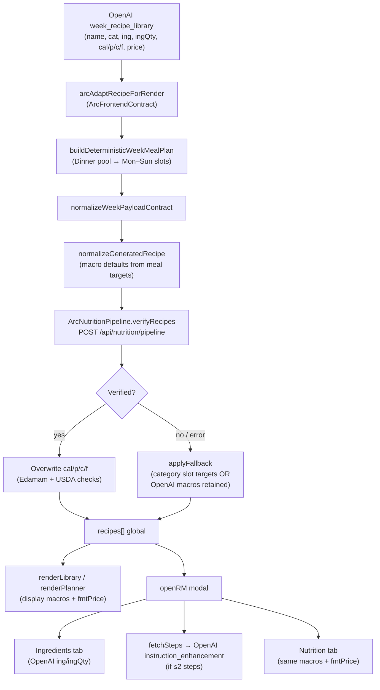

# Recipe Pipeline Map

> Audit of the current recipe rendering pipeline.  
> Example trace: **Beef Stir-Fry** (Dinner) from the production week-generation path.  
> Documentation only — no code changes.

---

## Scope

This document traces how a recipe object moves from generation to display in:

- **Library cards** (`renderLibrary`)
- **Planner rows** (`renderPlanner`)
- **Recipe modal** (`openRM` → ingredients / steps / nutrition tabs)
- **Shopping list** (ingredient-level pricing, separate from per-recipe `price`)

**Primary path audited:** `generateWeeklyPlan()` → OpenAI recipe library → deterministic week assignment → nutrition verification → render.

**Secondary path noted:** Legacy `generateRecipes()` (28-recipe batch) includes `steps` in the initial OpenAI response; week path does not.

---

## End-to-end flow (Beef Stir-Fry)



---

## RECIPE PIPELINE MAP

### Recipe Name

**Source:** OpenAI (`taskType: week_recipe_library`)

| Stage | Detail |
|-------|--------|
| **Original provider** | OpenAI via `POST /api/ai` — `callAIWithRetry(built.sysMsg, built.userMsg, …, 'week_recipe_library')` in `generateWeeklyPlan()` |
| **Transformations** | `arcAdaptRecipeForRender()` → `ArcFrontendContract.adaptRecipeToFrontendContract()` maps `title` → `name`; default `'Recipe'` if missing |
| **Fallback logic** | `normalizeWeekPayloadContract`: `'Recipe ' + (idx + 1)`; `normalizeGeneratedRecipe`: `'Recipe ' + (i + 1)` |
| **Final displayed value source** | `recipes[i].name` read directly by `renderLibrary` (`shopEsc(r.name)`) and `openRM` (`el('rm-title').textContent`) — **unchanged after OpenAI** |

---

### Ingredients

**Source:** OpenAI (week library prompt explicitly requests `ing` + optional `ingQty`)

| Stage | Detail |
|-------|--------|
| **Original provider** | OpenAI JSON: `"ing": ["Beef sirloin", "Broccoli", …]`, `"ingQty": {"Beef sirloin": "8 oz", …}` |
| **Transformations** | `ArcFrontendContract.normalizeIngredientsInput()` — maps `ingredients[]` objects → string names if legacy shape; `normalizeGeneratedRecipe` copies `ing[]` and `ingQty{}` verbatim; modal applies `scaleIngredientQtyString(qraw, mult)` for serving multiplier |
| **Fallback logic** | Missing `ing` → `[]`; missing per-item qty in modal → `'—'`; `ArcFrontendContract` does not invent ingredients |
| **Final displayed value source** | **OpenAI strings, unverified** — `buildIngredientsTab(curRecipe)` renders `r.ing` + scaled `r.ingQty` |

**Downstream use (not displayed as ingredients):**  
`ArcNutritionPipeline.ingredientLines()` joins `ingQty + ing` and normalizes via `ArcApi.Edamam.normalizeIngredientLines` (from `edamamHelpers.js`) before sending to Edamam. Edamam parse results are **not written back** to `r.ing`.

---

### Instructions

**Source:** OpenAI — but **not in the week library prompt**; generated lazily on modal open

| Stage | Detail |
|-------|--------|
| **Original provider (week path)** | Week prompt (`buildWeekRecipeLibraryPrompt`) says: *"Do NOT include steps or long instructions."* Initial recipe has **no steps** from OpenAI |
| **Transformations** | `ArcFrontendContract.validateFrontendRecipeContract`: if no steps → injects placeholder `[{ phase: 'Cook', instruction: 'Prepare ingredients and cook until done.' }]`; `normalizeGeneratedRecipe` runs `normalizeRecipeSteps()` |
| **Fallback logic (modal)** | `fetchSteps(id)`: if `steps.length <= 2` (always true for week recipes), calls OpenAI `instruction_enhancement`; on AI failure uses 3-step generic fallback (Prep / Cook / Serve boilerplate) |
| **Final displayed value source** | **OpenAI `instruction_enhancement`**, cached in `stepCache[id]` — displayed by `buildStepsTab()` in recipe modal and Today peek |

**Legacy path difference:** `generateRecipes()` asks OpenAI for 5–8 steps in the initial JSON; those skip lazy fetch if `steps.length > 2`.

---

### Calories

**Source:** Edamam (primary) → USDA validation (server) — with multiple fallbacks

| Stage | Detail |
|-------|--------|
| **Original provider** | OpenAI estimate in library JSON (`cal` field), informed by `formatNutritionPromptBlock()` targets derived from Arc Engine daily macros |
| **Transformations** | ① `normalizeGeneratedRecipe`: `Math.round(num(r.cal, t.cal))` — fills from **category meal target** if OpenAI omits; ② `ArcNutritionPipeline.verifyRecipe`: sends `reported.cal` to server; ③ on success overwrites `recipe.cal = Math.round(data.macros.calories)` |
| **Fallback logic** | See [Macro verification decision tree](#macro-verification-decision-tree) below |
| **Final displayed value source** | `r.cal` on global `recipes[]` — **Edamam-derived when verification succeeds**; otherwise category slot target or retained OpenAI value |

---

### Protein

**Source:** Same pipeline as Calories

| Stage | Detail |
|-------|--------|
| **Original provider** | OpenAI `p` field |
| **Transformations** | `normalizeGeneratedRecipe` → category target fallback; `verifyRecipe` overwrites `recipe.p = Math.round(data.macros.protein)` on success |
| **Fallback logic** | Same as Calories |
| **Final displayed value source** | `r.p` in `renderLibrary`, `renderPlanner` day sums, `buildNutTab` |

---

### Carbs

**Source:** Same pipeline as Calories

| Stage | Detail |
|-------|--------|
| **Original provider** | OpenAI `c` field |
| **Transformations** | Same as Protein (`recipe.c = Math.round(data.macros.carbs)`) |
| **Fallback logic** | Same as Calories |
| **Final displayed value source** | `r.c` in library cards, planner, nutrition tab |

---

### Fat

**Source:** Same pipeline as Calories

| Stage | Detail |
|-------|--------|
| **Original provider** | OpenAI `f` field |
| **Transformations** | Same as Protein (`recipe.f = Math.round(data.macros.fat)`) |
| **Fallback logic** | Same as Calories |
| **Final displayed value source** | `r.f` in library cards, planner, nutrition tab |

---

### Estimated Cost

**Source:** OpenAI per-recipe estimate — **never verified against Kroger or Arc Budget Engine**

| Stage | Detail |
|-------|--------|
| **Original provider** | OpenAI `price` field (USD/serving) in week library JSON; prompt includes budget tier guidance |
| **Transformations** | `normalizeGeneratedRecipe`: `num(r.price, 6.00)` — default **$6.00** if missing; display via `fmtPrice(r.price)` = `price × REGIONS[UP.region].mult` |
| **Fallback logic** | Default $6.00/serving; regional multiplier from `REGIONS` table (e.g. `us-northeast` × 1.30) |
| **Final displayed value source** | **`r.price` (OpenAI) × regional multiplier** — shown in library macro row (`fmtPrice(r.price)/serving`), planner slot price, nutrition tab ("Estimated cost … per serving based on your region") |

**Not connected to:** Kroger live prices (those apply to **shopping list lines**, not recipe cards), `ArcEngine.Budget` tiers, or `krogerService.arcGroceryFallback`.

---

## Macro verification decision tree

For each recipe (including Beef Stir-Fry), `ArcNutritionPipeline.verifyRecipe` → `POST /api/nutrition/pipeline`:

```
1. Build ingr[] from ing + ingQty (EdamamHelpers normalize only)
2. Server: Edamam nutrition-details → macros
   └─ on failure → nutritionFallbackAfterEdamam:
        a. Spoonacular bulk (uses recipe.id as ID — NOT a Spoonacular ID for AI recipes → usually fails)
        b. USDA aggregateUsdaNutritionFromIngredients (full ingredient loop)
3. Server: USDA sample check on FIRST ingredient only (±85% calorie drift)
4. Server: macro sanity (P×4 + C×4 + F×9 vs calories, bounds)
5. Client: ArcValidation.detectImpossibleNutrition
```

| Outcome | cal/p/c/f source | nutritionVerified | nutritionConfidence |
|---------|------------------|-------------------|---------------------|
| Pipeline success | Edamam macros, source `edamam+usda` or `edamam` | `true` | `high` or `medium` |
| Edamam fails, USDA aggregate succeeds | USDA aggregated | `false` | `medium` |
| Edamam fails, Spoonacular succeeds | Spoonacular nutrition | `false` | `low` |
| Pipeline returns `verified: false` | **Category slot targets** (`computeMealNutritionTargets`) | `false` | unchanged / `medium` |
| Network / pipeline error | **Category slot targets** | `false` | unchanged |
| No ingredients | **Unchanged** (OpenAI or prior values) | `false` | unchanged |
| `ArcNutritionPipeline` not loaded | **OpenAI + normalizeGeneratedRecipe defaults** | n/a | `medium` (default string) |

**Category slot targets** come from `computeMealNutritionTargets()` (equal daily split), fed by `ArcRuntime.getMacroTargetsForProfile()` (Arc Engine TDEE/macros) — **not** from `ArcEngine.MealOptimizer` weighted slots.

---

## Render call sites (final display)

| UI surface | Function | Fields read |
|------------|----------|-------------|
| Library card | `renderLibrary()` | `name`, `cal`, `p`, `c`, `f`, `fmtPrice(price)`, `time`, `difficulty`, `cat` |
| Planner day/slot | `renderPlanner()` | `name`, `cal` (day sum), `fmtPrice(price)` (day sum) |
| Recipe modal — ingredients | `buildIngredientsTab()` | `ing[]`, `ingQty{}` (scaled) |
| Recipe modal — steps | `buildStepsTab(stepCache[id])` | OpenAI-enhanced steps |
| Recipe modal — nutrition | `buildNutTab()` | `cal`, `p`, `c`, `f`, `fmtPrice(price)` |
| Shopping list | `GroceryOptimizer` + `buildRealisticPurchaseLine()` | Ingredient names from `r.ing`; **separate** heuristic/Kroger pricing |

**Not displayed anywhere:** `nutritionConfidence`, `nutritionVerified`, `nutritionSource` (stored on object only).

---

## Gap analysis

### OpenAI data displayed without verification

| Field | Shown where | Verified? |
|-------|-------------|-----------|
| **Recipe name** | Library, planner, modal title | No |
| **Ingredients + quantities** | Modal ingredients tab | No — Edamam parses for macros only; results not written back |
| **Instructions** | Modal steps tab | No — generated/enhanced by OpenAI on demand |
| **price (estimated cost)** | Library, planner, nutrition tab | No — never sent to Kroger or Budget Engine |
| **time, difficulty, tags** | Library cards, modal tags | No |
| **servings** | Modal serving stepper context | No |
| **Macros (cal/p/c/f)** | Library, planner, nutrition tab | **Attempted** via Edamam/USDA pipeline; on failure falls back to slot targets or unverified OpenAI values |

### USDA verification skipped or weakened

| Condition | Effect |
|-----------|--------|
| `USDA_API_KEY` not configured | USDA sample check block skipped; `usdaIngredientOk` stays `true`; confidence may still be `high` from Edamam alone |
| USDA search throws | Catch sets `usdaIngredientOk = true` — **fail-open** |
| USDA sample uses **only first ingredient** | Full recipe not reconciled against USDA FoodData Central |
| `aggregateUsdaNutritionFromIngredients` | Only runs on **Edamam failure** fallback path, not on happy path |
| Pipeline returns `verified: false` with macros present | Client `applyFallback` **discards** server macros and substitutes category slot targets |
| Profile reload from `localStorage` / Supabase | Saved recipes render **without re-verification** |

### Spoonacular data ignored

| Context | Detail |
|---------|--------|
| Production week generation | Spoonacular services **not loaded** in `index.html`; no catalog lookup for AI-generated recipes |
| Nutrition pipeline fallback | `spoonacularRecipeId` passed as `recipe.id` (local integer, e.g. `3`) — **not** a Spoonacular API ID, so `fetchSpoonacularNutrition()` almost always fails for week recipes |
| Recipe content | Titles, ingredients, instructions never enriched from Spoonacular `extendedIngredients` or `instructions` |
| Adaptive orchestrator | `ArcApi.Orchestrator.runAdaptiveMealPipeline` (Spoonacular-first) exists in tests only |

### Arc Engine calculations unused in render path

| Engine module | Loaded? | Used in recipe render? |
|---------------|---------|------------------------|
| `ArcEngine.Nutrition` + `Goal` | Yes | **Partial** — daily `calT` / `macros` via `ArcRuntime` for prompts and `% of daily target` in nutrition tab |
| `ArcEngine.MealOptimizer` | Yes | **No** — render uses `computeMealNutritionTargets()` equal split, not weighted slot presets |
| `ArcEngine.PortionScaler` | Yes (script tag) | **No** — serving multiplier scales ingredient qty strings only (`scaleIngredientQtyString`); macros do not scale with servings |
| `ArcEngine.Budget` | Yes | **No** — recipe `price` comes from OpenAI, not tier constraints |
| `ArcEngine.Adherence` | Yes | **No** in render pipeline |
| `ArcEngine.Athlete` | Yes | **No** in render pipeline |
| `ArcEngine.run()` | Yes | **Not called** during week generation or render |

---

## Path comparison: week vs legacy batch

| Aspect | Week path (`generateWeeklyPlan`) | Legacy path (`generateRecipes`) |
|--------|----------------------------------|----------------------------------|
| OpenAI task | `week_recipe_library` (4–8 recipes) | Generic JSON array (28 recipes) |
| Steps in initial response | **Excluded** by prompt | **Required** (5–8 steps) |
| Meal assignment | `buildDeterministicWeekMealPlan` | Manual / separate plan flow |
| Macro verification | `ArcNutritionPipeline.verifyRecipes` | `arcVerifyRecipesBeforeSave` (same pipeline) |
| Instruction display | Lazy `fetchSteps` → OpenAI | Cached from initial response if >2 steps |

---

## Beef Stir-Fry worked example (typical week path)

Assuming OpenAI returns:

```json
{
  "id": 3,
  "name": "Beef Stir-Fry",
  "cat": "Dinner",
  "cal": 620,
  "p": 42,
  "c": 45,
  "f": 28,
  "servings": 3,
  "ing": ["Beef sirloin", "Broccoli", "Soy sauce", "Garlic", "Vegetable oil", "Rice"],
  "ingQty": {"Beef sirloin": "8 oz", "Broccoli": "2 cups", "Rice": "1 cup cooked"},
  "price": 8.50
}
```

| Field | After pipeline (typical success) | Shown to user as |
|-------|-------------------------------|------------------|
| Name | `Beef Stir-Fry` | `Beef Stir-Fry` |
| Ingredients | Same 6 strings + qty map | Scaled by serving stepper in modal |
| Instructions | Placeholder → then OpenAI 5–8 steps on "View recipe" | Prep / Cook / Serve sections |
| Calories | Edamam analysis e.g. `587` (replaces 620) | `587 kcal` on card |
| Protein / Carbs / Fat | Edamam/USDA verified values | `g` badges on card |
| Estimated cost | `8.50` (unchanged) | `$8.50/serving` × region mult e.g. `$11.05` in Northeast |

Assigned to **Mon/Wed/Fri Dinner** (or similar) via `pool[d % pool.length]` in `buildDeterministicWeekMealPlan`.

---

## Key files

| File | Role in pipeline |
|------|-----------------|
| `index.html` | `generateWeeklyPlan`, `normalizeGeneratedRecipe`, `renderLibrary`, `renderPlanner`, `openRM`, `fetchSteps`, `fmtPrice` |
| `js/arc-frontend-contract.js` | Schema normalization, placeholder steps |
| `js/arc-nutrition-pipeline.js` | Client verification orchestration, fallbacks |
| `server.js` | `/api/nutrition/pipeline` — Edamam, USDA sample, sanity checks |
| `js/arc-api/edamamHelpers.js` | Ingredient line normalization before Edamam |
| `js/arc-runtime.js` | Profile → Arc Engine macro targets for prompts |

---

*Generated from static codebase analysis. No production code was modified.*
