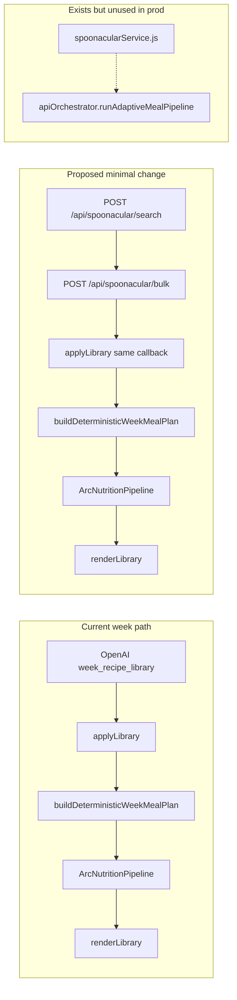

# Spoonacular Integration Audit

> Documentation-only audit of Spoonacular usage in the NutriAI / Arc codebase.  
> No production code was modified.

---

## Summary

Spoonacular is **fully wired on the server and in the Arc API layer**, but **almost entirely unused in production UI**. The browser never loads Spoonacular client services; week generation creates all recipe content via OpenAI. Spoonacular only runs in practice as a **broken nutrition fallback** (local recipe IDs passed instead of Spoonacular IDs) and in **Node tests** via `ArcApi.Orchestrator`.

---

## CURRENT SPOONACULAR USAGE

### 1. Exactly where Spoonacular is used today

| Location | Function / route | When it runs | Purpose |
|----------|------------------|--------------|---------|
| **`server.js`** | `POST /api/spoonacular/search` (~658–698) | On HTTP request | Proxies `complexSearch` — discovery by query, diet, calories, protein, time, price |
| **`server.js`** | `POST /api/spoonacular/bulk` (~701–764) | On HTTP request | Proxies `informationBulk` — full recipe detail for ID list |
| **`server.js`** | `fetchSpoonacularNutrition()` (~406–427) | Internal | Fetches bulk with `includeNutrition=true`, extracts macro summary |
| **`server.js`** | `nutritionFallbackAfterEdamam()` (~508–524) | When Edamam fails in `/api/nutrition` or `/api/nutrition/pipeline` | Spoonacular nutrition → then USDA aggregate |
| **`js/arc-api/spoonacularService.js`** | `searchRecipes`, `getRecipeBulk`, etc. | When Arc API scripts loaded | Client wrappers → BFF proxies above |
| **`js/arc-api/providers/spoonacularProvider.js`** | `discoverMeals`, `retrieveRecipe`, `getRecipeMetadata` | Via orchestrator dispatch | Adapter layer for `apiOrchestrator.js` |
| **`js/arc-api/apiOrchestrator.js`** | `runAdaptiveMealPipeline()` (~467+) | **Tests only** (not in production HTML) | Search → Edamam → USDA → curation → OpenAI → Kroger |
| **`js/arc-api/apiOrchestrator.js`** | `resolveNutritionAfterEdamamFailure()` (~357+) | Orchestrator + Edamam service path | Bulk fetch with nutrition on Edamam failure |
| **`js/arc-api/edamamService.js`** | `nutritionFromSpoonacularFallback()` (~139–161) | When Edamam `/api/nutrition` fails (orchestrator path) | Delegates to `spoonacular.getRecipeBulk` |
| **`js/arc-nutrition-pipeline.js`** | `verifyRecipe()` (~114) | **Production week path** | Passes `spoonacularRecipeId` to pipeline — but value is **local `recipe.id`**, not Spoonacular ID |
| **`js/config/apiConfig.js`** | Provider flag | Server + client bootstrap | `SPOONACULAR_API_KEY` readiness check |
| **`tests/arc-api.test.js`** | Multiple tests | CI / `npm run test:arc-api` | Mocks `/api/spoonacular/search`, exercises orchestrator |

### 2. What each proxy returns

#### `POST /api/spoonacular/search` → `complexSearch`

Upstream: `GET https://api.spoonacular.com/recipes/complexSearch?addRecipeInformation=true&…`

**Server response shape (stripped):**

```javascript
{
  results: [{
    id, recipeId, title, image, servings, readyInMinutes, prepTime,
    ingredients: [],   // always empty — not forwarded from upstream
    tags: [diets, cuisines, dishTypes]
  }],
  total
}
```

Supported filter params from client body: `query`, `diet`, `maxCalories`, `minProtein`, `maxReadyTime`, `maxPrice`, `number`.

#### `POST /api/spoonacular/bulk` → `informationBulk`

Upstream: `GET https://api.spoonacular.com/recipes/informationBulk?ids=…&includeNutrition=true|false`

**Server response shape:**

```javascript
{
  recipes: [{
    id, recipeId, title, image, servings, readyInMinutes,
    extendedIngredients: [...],   // full upstream array preserved
    ingredients: [{ name, original, amount, unit }],
    tags: [...],
    instructions: ["step text", ...],   // from analyzedInstructions[0].steps
    nutrition: { calories, protein, carbs, fat },  // if includeNutrition
    calories, protein, carbs, fat                  // top-level copies
  }],
  instructions: { [recipeId]: string[] }
}
```

#### Nutrition fallback (`fetchSpoonacularNutrition`)

Extracts from `recipe.nutrition.nutrients`: Calories, Protein, Fat, Carbohydrates.  
Labeled **`low` confidence** when used; Arc does not treat Spoonacular as macro source of truth.

---

### 3. Production script load status

**Loaded in `index.html` (~2591–2613):**

| Script | Loaded? |
|--------|---------|
| `js/arc-api/spoonacularService.js` | **No** |
| `js/arc-api/providers/spoonacularProvider.js` | **No** |
| `js/arc-api/apiOrchestrator.js` | **No** |
| `js/arc-api/edamamService.js` | **No** |

**Loaded (shared infra used by Spoonacular if it were loaded):**

| Script | Loaded? |
|--------|---------|
| `js/arc-api-base.js` | Yes |
| `js/arc-api/arcCache.js` | Yes |
| `js/arc-api/arcRateLimit.js` | Yes |
| `js/arc-api/arcTrace.js` | Yes |
| `js/arc-api/providers/providerBase.js` | Yes |

**`index.html` contains zero references** to `spoonacular`, `/api/spoonacular/search`, or `/api/spoonacular/bulk`.

**Server (`server.js`)** always exposes Spoonacular routes when `SPOONACULAR_API_KEY` is set — production-ready BFF, unused by browser week flow.

---

### 4. Services: loaded vs exist-but-unused

| Service / method | Exists in codebase | Loaded in production | Called in production |
|------------------|---------------------|----------------------|----------------------|
| `searchRecipes` / `complexSearch` | Yes | No | No |
| `getRecipeBulk` / `informationBulk` | Yes | No | No (only server-internal fallback) |
| `getRecipeIngredients` | Yes (wraps bulk) | No | No |
| `getRecipeInstructions` | Yes (wraps bulk) | No | No |
| `filterRecipes` | Yes (client-side) | No | No |
| `retrieveRecipe` (provider) | Yes | No | No |
| `getRecipeMetadata` (provider) | Yes | No | No |
| `discoverMeals` / `searchRecipes` (provider) | Yes | No | No |
| `runAdaptiveMealPipeline` | Yes | No | No |
| `nutritionFromSpoonacularFallback` | Yes | No | No (edamamService not loaded) |
| `fetchSpoonacularNutrition` (server) | Yes | N/A | **Yes** — Edamam failure path only |
| `resolveNutritionAfterEdamamFailure` | Yes | No | No |

---

## Can Spoonacular provide? (via current Arc proxies)

| Capability | Available? | How | Used for week recipes today? |
|------------|------------|-----|------------------------------|
| **Ingredients** | **Yes** | Bulk `extendedIngredients` / `ingredients[]` with `name`, `original`, `amount`, `unit` | **No** — OpenAI generates `ing`/`ingQty` |
| **Instructions** | **Yes** | Bulk `analyzedInstructions` → string steps (no Prep/Cook/Serve phases) | **No** — lazy OpenAI `instruction_enhancement` on modal open |
| **Nutrition** | **Yes** | Bulk with `includeNutrition: true` → calories, protein, carbs, fat | **No** for content — Edamam+USDA pipeline overwrites; Spoonacular fallback ineffective (wrong ID) |
| **Recipe metadata** | **Yes** | Search + bulk: `title`, `image`, `servings`, `readyInMinutes`, `tags` (diets/cuisines/dishTypes) | **No** — OpenAI generates name, time, difficulty, tags |

**Search alone is insufficient** for week generation: the server zeroes out `ingredients` in search results. A bulk fetch is required for ingredients and instructions.

**Not implemented in Arc** (Spoonacular API features with no proxy):

- Single-recipe `/recipes/{id}/information` (only bulk exists)
- `/recipes/{id}/analyzedInstructions` as separate endpoint
- `/recipes/extract` (URL parsing)
- `/recipes/random`
- `/recipes/findByIngredients`
- `/recipes/{id}/similar`
- `/recipes/{id}/priceBreakdownWidget` / grocery-specific endpoints
- `/food/ingredients/*` autocomplete/search
- Meal-plan endpoints

---

## UNUSED SPOONACULAR CAPABILITIES

### Wired but never called from production UI

1. **Recipe discovery (`complexSearch`)** — full filter surface (diet, maxCalories, minProtein, maxReadyTime, maxPrice) exposed on BFF, never invoked from `index.html`.
2. **Bulk recipe detail** — ingredients, instructions, image, tags; only server-side nutrition fallback attempts it (with wrong IDs).
3. **`filterRecipes()`** — client-side post-search filtering; no callers outside `spoonacularService.js`.
4. **`getRecipeIngredients()` / `getRecipeInstructions()`** — thin bulk wrappers; no external callers.
5. **Orchestrator pipeline** — complete Spoonacular-first meal flow in `runAdaptiveMealPipeline`; test-only.
6. **Recipe curation scoring** — orchestrator uses Spoonacular candidates + `ArcApi.Curation`; not connected to week gen.
7. **Images** — `image` URL returned by proxies, never displayed in week flow (OpenAI recipes have `image: null`).
8. **Search `addRecipeInformation=true`** — upstream may return more data, but **Arc server discards it** and returns `ingredients: []`.

### Broken / ineffective usage

| Issue | Detail |
|-------|--------|
| **Wrong ID in nutrition fallback** | `arc-nutrition-pipeline.js` sends `spoonacularRecipeId: recipe.id` (local 1–8). Server calls Spoonacular with that ID → wrong recipe or 404. |
| **Search without bulk** | Even if production called search, it would get titles only — no ingredient lines for Edamam. |

### Spoonacular API not proxied at all

- Ingredient autocomplete / parsing endpoints
- Random recipe / find-by-ingredients
- Similar recipes
- Price breakdown widget
- URL-based recipe extraction

---

## RECOMMENDED INTEGRATION PLAN

### Phase 0 — Fix existing fallback (prerequisite)

When storing recipes from Spoonacular, persist **`spoonacularId`** (real API id) separately from display **`id`** (local 1–8). Update `arc-nutrition-pipeline.js` to prefer `recipe.spoonacularId` over `recipe.id`.  
**Without this, any Spoonacular integration still has a broken nutrition fallback.**

### Phase 1 — Smallest code change for week generation (Spoonacular content instead of OpenAI)

**Goal:** Replace OpenAI as the source of recipe **name, ingredients, instructions, metadata** in `generateWeeklyPlan()`. Keep OpenAI optional for copy/optimization only. Keep `ArcNutritionPipeline` for macro verification.

**Single surgical change point:** `generateWeeklyPlan()` in `index.html` (~10550) — replace:

```javascript
callAIWithRetry(built.sysMsg, built.userMsg, 2000, applyLibrary, 2, 'week_recipe_library');
```

with a Spoonacular fetch that produces the same `{ recipes: [...] }` shape `applyLibrary` expects.

**Minimal implementation (no new files required):**

```javascript
// 1. Add helper above generateWeeklyPlan (uses existing arcApiPath + fetch pattern from callAI)

function fetchSpoonacularWeekLibrary(built, callback) {
  var perCat = built.libraryTargets.perCat;  // { Breakfast: 2, Lunch: 2, Dinner: 2, ... }
  var categories = Object.keys(perCat);
  var queries = {
    Breakfast: 'breakfast high protein',
    Lunch: 'lunch',
    Dinner: 'dinner stir fry',
    Snack: 'healthy snack'
  };
  var slotTarget = built.mt.perSlot;

  function searchCategory(cat) {
    return fetch(arcApiPath('/api/spoonacular/search'), {
      method: 'POST',
      headers: { 'Content-Type': 'application/json' },
      body: JSON.stringify({
        query: queries[cat] || cat.toLowerCase(),
        diet: (UP.restrictions || []).join(',').toLowerCase() || undefined,
        maxCalories: Math.round(slotTarget.cal * 1.15),
        number: perCat[cat]
      })
    }).then(function (r) { return r.json(); })
      .then(function (data) { return (data.results || []).map(function (x) { return x.id; }); });
  }

  Promise.all(categories.map(searchCategory))
    .then(function (idGroups) {
      var ids = [].concat.apply([], idGroups).filter(Boolean);
      return fetch(arcApiPath('/api/spoonacular/bulk'), {
        method: 'POST',
        headers: { 'Content-Type': 'application/json' },
        body: JSON.stringify({ ids: ids, includeNutrition: false })
      }).then(function (r) { return r.json(); });
    })
    .then(function (bulk) {
      var recipes = (bulk.recipes || []).map(function (sp, i) {
        var ing = (sp.extendedIngredients || sp.ingredients || []);
        var ingNames = ing.map(function (x) { return x.name || x.original; });
        var ingQty = {};
        ing.forEach(function (x) {
          var key = x.name || x.original;
          if (key) ingQty[key] = [x.amount, x.unit].filter(Boolean).join(' ') || x.original;
        });
        var steps = (sp.instructions || []).map(function (txt) {
          return { phase: 'Cook', instruction: String(txt) };
        });
        return {
          id: i + 1,
          spoonacularId: sp.recipeId || sp.id,
          name: sp.title,
          cat: /* map from search category bucket, not dishTypes */ categories[Math.floor(i / 2)] || 'Lunch',
          ing: ingNames,
          ingQty: ingQty,
          steps: steps,
          servings: sp.servings || 2,
          time: (sp.readyInMinutes || sp.prepTime || 25) + ' min',
          image: sp.image,
          tags: sp.tags || [],
          price: 6.0   // still need estimate or maxPrice filter; Spoonacular has no per-serving price in bulk
        };
      });
      callback(null, { recipes: recipes }, { source: 'spoonacular' });
    })
    .catch(function (err) { callback(err); });
}

// 2. In generateWeeklyPlan, replace callAIWithRetry line:
fetchSpoonacularWeekLibrary(built, applyLibrary);
```

**Why this is the smallest change:**

| What | Changes |
|------|---------|
| Files touched | **`index.html` only** (~1 new helper + 1 line swap) |
| Script tags | **None** — uses raw `fetch` to existing BFF routes (same as `callAI`) |
| Downstream pipeline | **Unchanged** — `applyLibrary` → `buildDeterministicWeekMealPlan` → `applyWeek` → `normalizeGeneratedRecipe` → `ArcNutritionPipeline.verifyRecipes` → render |
| OpenAI | Removed from library step only; can remain for `fetchSteps` / optimization |

**Required follow-ups (still small, same file or adjacent):**

1. **`applyLibrary` / `parseAiObject`** — accept `meta.source === 'spoonacular'` (today only checks for `enhancement` rejection).
2. **Category assignment** — search per category separately and tag `cat` from bucket, not from Spoonacular `dishTypes` (Stir-Fry may not self-identify as Dinner).
3. **`normalizeGeneratedRecipe`** — preserve `spoonacularId` field (passthrough).
4. **`fetchSteps`** — skip OpenAI when `steps.length > 2` (Spoonacular bulk typically provides enough steps).

### Phase 2 — Load client service (optional, cleaner)

Add one script tag:

```html
<script src="js/arc-api/spoonacularService.js"></script>
```

Replace raw `fetch` helper with `ArcApi.Services.spoonacular.searchRecipes` + `getRecipeBulk`. Same swap at line ~10550. Slightly more code but reuses cache, rate limit, and `normalizeRecipe`.

### Phase 3 — Orchestrator alignment (larger)

Route week generation through `ArcApi.Orchestrator.runAdaptiveMealPipeline` or extract shared `discoverAndNormalizeRecipes(profile)` used by both tests and UI. Requires loading full Arc API script stack in `index.html`.

### Phase 4 — Do not use Spoonacular for macros

Keep **`ArcNutritionPipeline` → Edamam → USDA** as display macro source. Spoonacular nutrition may inform search filters (`maxCalories`, `minProtein`) but should not replace verified macros.

---

## Architecture diagram (current vs proposed)



---

## Decision matrix: OpenAI vs Spoonacular for week content

| Field | OpenAI today | Spoonacular bulk | Recommendation |
|-------|--------------|------------------|----------------|
| Name | Generated | `title` | Spoonacular |
| Ingredients | Generated strings | `extendedIngredients` | Spoonacular |
| Instructions | Lazy AI | `analyzedInstructions` steps | Spoonacular (skip lazy fetch) |
| Macros (display) | AI estimate → Edamam verify | Optional nutrition | **Edamam+USDA only** |
| Price | AI estimate | Not in bulk; use `maxPrice` filter + heuristic | Keep AI estimate or Arc Budget tier until Kroger |
| Image | null | `image` URL | Spoonacular |
| Diet compliance | Prompt-based | `diet` search param + tags | Both; validate with Edamam labels |

---

## Key files reference

| File | Spoonacular role |
|------|------------------|
| `server.js` | BFF proxies, nutrition fallback |
| `js/arc-api/spoonacularService.js` | Client API (test / future) |
| `js/arc-api/providers/spoonacularProvider.js` | Orchestrator adapter |
| `js/arc-api/apiOrchestrator.js` | Adaptive pipeline (test-only) |
| `js/arc-nutrition-pipeline.js` | Passes `spoonacularRecipeId` (currently wrong) |
| `js/arc-api/edamamService.js` | Spoonacular fallback after Edamam |
| `index.html` | Week gen — **no Spoonacular today** |
| `tests/arc-api.test.js` | Primary consumer of Spoonacular flow |

---

*Generated from static codebase analysis. No production code was modified.*
